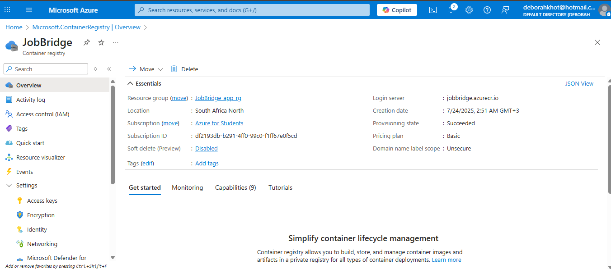
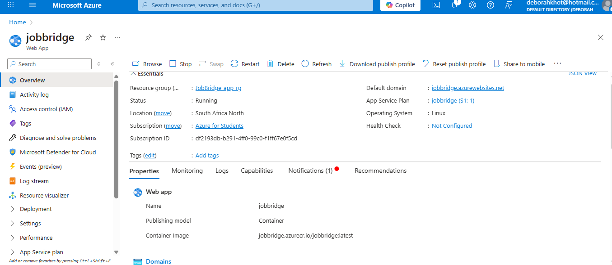

## `phase.md` File – Deployment & Reflection

### `phase.md` Template:
```md
## Live Application URL
http://jobbridge.azurewebsites.net

## Screenshots of Azure Resources

### Azure Container Registry



### Web App Resource



### Resource Group

---

## Peer Review Pull Request

I reviewed this PR: [Peer Review PR](https://github.com/peer-username/peer-project/pull/12)

---

## Reflection: Challenges of IaC vs Manual Deployment

Setting up cloud infrastructure manually through the Azure CLI taught me the importance of automation. While it was helpful for learning, manual deployment is more prone to human error and takes time. In contrast, using Infrastructure as Code (IaC) allows us to provision resources consistently and faster using templates like Bicep or ARM. I now better appreciate the value of IaC for repeatable and scalable deployments, especially in team environments.

---

